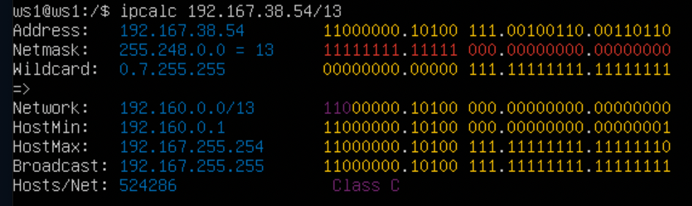
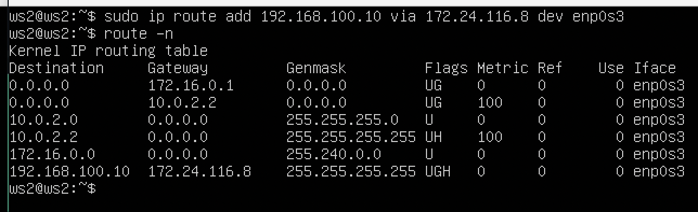
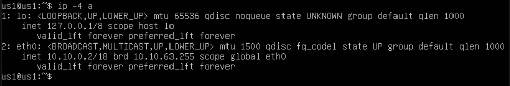
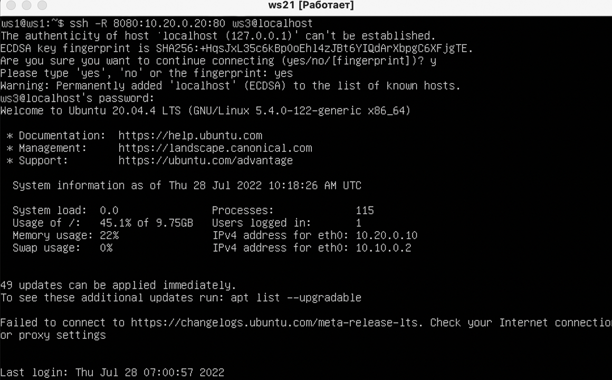

## Part 1. Инструмент ipcalc

- Поднять виртуальную машину (далее -- ws1)

- 0.1. Установка виртуальной машины (далее -- ws1)

- 0.2. Установка ipcalc 

- sudo apt install ipcalc

- 1.1. Сети и маски

- 1.1.1 Адрес сети 192.167.38.54/13 

- 1.1.2.1 Перевод маски 255.255.255.0 в префиксную и двоичную запись 

- 1.1.2.2 Перевод маски /15 в обычную и двоичную запись

- 1.1.2.3 Перевод маски 11111111.11111111.11111111.11110000 в обычную и префиксную запись запись 

- 1.1.3 Минимальный и максимальный хост в сети 12.167.38.4 при маскаx:
- 1.1.3.1 /8

- 1.1.3.2 11111111.11111111.00000000.00000000

- 1.1.3.3 255.255.254.0 

- 1.1.3.4 /4 

- 1.2. localhost

     - Для localhost зарезервирован диапазон ip 127.0.0.1 - 127.255.255.254. Поэтому обратиться к приложению, работающем на localhost с IP 194.34.23.100 и 128.0.0.1 мы не сможем, тогда как к IP 127.0.0.2 и 127.1.0.1 сможем.

- 1.3. Диапазоны и сегменты сетей

- Диапазоны частных "серых" ip-адресов:

    - 10.0.0.0 - 10.255.255.255 
    - 172.16.0.0 - 172.31.255.255 
    - 192.168.0.0 - 192.168.255.255
    Поэтому:
    - 10.0.0.45 - Частный
    - 134.43.0.2 - Публичный
    - 192.168.4.2 - Частный
    - 172.20.250.4 - Частный
    - 172.0.2.1 - Публичный
    - 192.172.0.1 - Публичный
    - 172.68.0.2 - Публичный
    - 172.16.255.255 - Частный
    - 10.10.10.10 - Частный
    - 192.169.168.1 - Публичный
- 2 Шлюзы, возможные у сети 10.10.0.0/18:

    - 10.10.0.2
    - 10.10.10.10
    - 10.10.1.255

## Part 2. Статическая маршрутизация между двумя машинами

- C помощью команды ip a посмотреть существующие сетевые интерфейсы
- 2.0.1 Отчет вывода команды ip a для машины ws1 

- 2.0.2 Отчет вывода команды ip a для машины ws2 

- 2.0.3 Установка для машины ws1 адреса 192.168.100.10/16 

- машины ws2 адреса 172.24.116.8/12 

- netplan apply для машины ws1 и ws2

- 2.1. Добавление статического маршрута вручную
- 2.1.1 Добавление статического маршрута от машины ws1 к ws2. Вывод результата пингования 

- 2.1.2 Добавление статического маршрута от машины ws2 к ws1. Вывод результата пингования

- 2.2. Добавление статического маршрута с сохранением
- 2.2.1 Добавление статического маршрутка от машины ws1 к ws2 после перезапуска 

- 2.2.2 Добавление статического маршрутка от машины ws2 к ws1 после перезапуска 

- 2.2.3 Принятие изменений (sudo netplan apply)
- Вывод результата пингования машины ws1 к ws2 

- 2.2.5 Вывод результата пингования машины ws2 к ws1 

## Part 3. Утилита iperf3

- 3.1. Скорость соединения

    - 8 Mpbs = 1 MB/s
    - 100 MB/s = 800000 Kbps
    - 1 Gbps = 1000 Mbps
- 3.2. Утилита iperf3
- 3.2.1 Установка машины ws1 как сервер при помощи команды iperf3 -s с последующим измерением скорости соединения 

- 3.2.2 Установка машины ws2 как принимающего устройства при помощи команды iperf3 -c 192.168.100.10 -p 5201 с последующим измерением скорости соединения 

## Part 4. Сетевой экран

- 4.1. Утилита iptables
- 4.1.1 Файл firewall.sh с содержимым для машины ws1 

- 4.1.2 Файл firewall.sh с содержимым для машины ws2 

- Стратегия для ws1:

    - на ws1 применить стратегию когда в начале пишется запрещающее правило, а в конце пишется разрешающее правило (это касается пунктов 3 и 4)
    - открыть на машинах доступ для порта 22 (ssh) и порта 80 (http)
    - запретить echo reply (машина не должна "пинговаться”, т.е. должна быть блокировка на OUTPUT)
    - разрешить echo reply (машина должна "пинговаться")

- Стратегия для ws2:

    - на ws2 применить стратегию когда в начале пишется разрешающее правило, а в конце пишется запрещающее правило (это касается пунктов 3 и 4)
    - открыть на машинах доступ для порта 22 (ssh) и порта 80 (http)
    - запретить echo reply (машина не должна "пинговаться”, т.е. должна быть блокировка на OUTPUT)
    - разрешить echo reply (машина должна "пинговаться")
- 4.2. Утилита nmap
- Командой ping найти машину, которая не "пингуется", после чего утилитой nmap показать, что хост машины запущен
- 4.2.1 Пропинговываем машину ws1 

- 4.2.2 Пропинговываем машину ws2. Вызываем функцию nmap для поверки подключения порта 

## Part 5. Статическая маршрутизация сети

- 5.1. Настройка адресов машин
- 5.1.1 Содержание файла etc/netplan/00-installer-config.yaml для машины ws11

- 5.1.2 Содержание файла etc/netplan/00-installer-config.yaml для машины ws21

- 5.1.3 Содержание файла etc/netplan/00-installer-config.yaml для машины ws22 

- 5.1.4 Содержание файла etc/netplan/00-installer-config.yaml для машины r1 

- 5.1.5 Содержание файла etc/netplan/00-installer-config.yaml для машины r2 

- 5.1.6 Адрес машины ws11 после перезапуска

- 5.1.7 Адрес машины ws21 после перезапуска

- 5.1.8 Адрес машины ws22 после перезапуска 

- 5.1.9 Адрес машины r1 после перезапуска 

- 5.1.10 Адрес машины r2 после перезапуска 

- 5.2. Включение переадресации IP-адресов.

- 5.2.1 Вызов команды sudo sysctl -w net.ipv4.ip_forward=1 для машин r1 и r2 

- 5.2.2 Скрин с содержание измененного файла /etc/sysctl/conf 

- 5.3. Установка маршрута по-умолчанию

- 5.3.1 Содержание файла etc/netplan/00-installer-config.yaml на машине ws11

- 5.3.2 Содержание файла etc/netplan/00-installer-config.yaml на машине ws21 

- 5.3.3 Содержание файла etc/netplan/00-installer-config.yaml на машине ws22 

- 5.3.4 Отчет команды ip r на машины ws11 

- 5.3.5 Отчет команды ip r на машины ws21 

- 5.3.6 Отчет команды ip r на машины ws22 

- 5.3.7 Пинг с ws11 роутер r2 

- 5.3.8 Проверка, что пинг доходит до r2 

- 5.4. Добавление статических маршрутов

- 5.4.1 Содержание файла etc/netplan/00-installer-config.yaml для машины r1 

- 5.4.2 Содержание файла etc/netplan/00-installer-config.yaml для машины r2 

- 5.4.3 Вывод команды ip r для машины r1 

- 5.4.4 Вывод команды ip r для машины r2 

- 5.4.5 Вывод команд ip r list 10.10.0.0/18 и ip r list 0.0.0.0/0 на машине ws11

- Для адреса 10.10.0.0/[порт сети] был выбран маршрут, отличный от 0.0.0.0/0, потому что маска /18 описывает маршрут к сети точнее, в отличие от маски /0
- 5.5. Построение списка маршрутизаторов

- 5.5.1 Вывод команды traceroute 10.20.0.10 -n на машине ws11 

- 5.5.2 Вывод команды tcpdump -tnv -i eth0 на машине r1 

 - Принцип работы traceroute

     - Для определения промежуточных маршрутизаторов traceroute отправляет серию пакетов данных целевому узлу, при этом каждый раз увеличивая на 1 значение поля TTL («время жизни»). Это поле обычно указывает максимальное количество маршрутизаторов, которое может быть пройдено пакетом. Первый пакет отправляется с TTL, равным 1, и поэтому первый же маршрутизатор возвращает обратно сообщение ICMP, указывающее на невозможность доставки данных. Traceroute фиксирует адрес маршрутизатора, а также время между отправкой пакета и получением ответа (эти сведения выводятся на монитор компьютера). Затем traceroute повторяет отправку пакета, но уже с TTL, равным 2, что позволяет первому маршрутизатору пропустить пакет дальше.

     - Процесс повторяется до тех пор, пока при определённом значении TTL пакет не достигнет целевого узла. При получении ответа от этого узла процесс трассировки считается завершённым.
- 5.6. Использование протокола ICMP при маршрутизации

- 5.6.1 Вывод команды ping -c 1 10.30.0.111 на машине ws11 

- 5.6.2 Вывод команды tcpdump -n -i eth0 icmp на машине r1 

## Part 6. Динамическая настройка IP с помощью DHCP

- 6.1 Изменение файла /etc/dhcp/dhcpd.conf и resolv.conf 

- 6.2 Перезагрузка службы DHCP при помощи команды systemctl restart isc-dhcp-server 

- 6.3 После перезагрузки машины ws21 проверяем получение адресса 

- 6.4 Результат пинга машины ws22 с ws21 

- 6.5 Изменение файла etc/netplan/00-installer-config.yaml для машины ws11 

- 6.6 Изменение файла /etc/dhcp/dhcpd.conf для машины r1 

- 6.7 Перезагрузка службы DHCP при помощи команды systemctl restart isc-dhcp-server 

- 6.8 После перезагрузки машины ws11 проверяем получение адресса 

- 6.9 Обновление адреса для машины ws21 при помощи запроса его у dhcp сервера при помощи команды sudo dhclient eth0 

- 6.10 ip машины ws21 до обновления 

- 6.11 ip машины ws21 после обновления 

## Part 7. NAT

- 7.1 Изменение файла /etc/apache2/ports.conf на машинах ws22 и r1 

- 7.2 Вызов команды service apache2 start на машинах ws22 и r1 

- 7.3 Запуск измененного файла firewall.sh на машине r2 

- 7.4 Проверка соединения между ws22 и r1. Соединение не проходит 

- 7.5 Проверка соединения между ws22 и r1 после добавления правила на разрешение маршрутизации пакетов протокола ICMP. Соединение проходит

- 7.6 Проверка соединения машины ws22 с r1 

- 7.7 Проверка соединения машины r1 с ws22 

## Part 8. Дополнительно. Знакомство с SSH Tunnels

- 8.1 Включил apache на машине ws22 и проверил статус 

- 8.2 Выполнение Local TCP forwarding 

- 8.3 Выполнение Remote TCP forwarding 

- 8.4 Проверка подключения 

